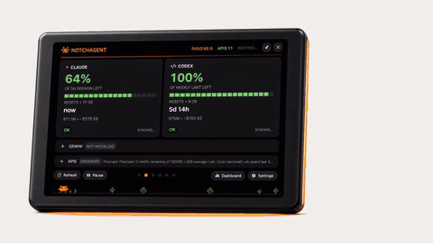
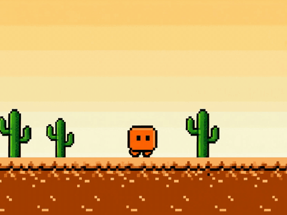

# NotchAgent Desk

**The fuel gauge for your AI quota — on your desk, not in a window.**

<p align="center">
  
</p>

<p align="center">
  <a href="https://img.shields.io/badge/version-v0.8.0-FF654F?style=flat-square"></a>
  <a href="protocol/PROTOCOL.md"></a>
  <a href="https://luisroquette.github.io/notchagent-desk/"></a>
  <a href="https://cfgauss.com.br/shop/notchagent-desk"></a>
</p>

NotchAgent Desk is the physical companion for
[NotchAgent](https://github.com/luisroquette/notchagent): a handmade 7-inch
capacitive touch display (1024x600) that turns your local Claude Code and Codex quota data into
a touch-first instrument — **NOW · BURN · RHYTHM · MODELS** — powered by an
ESP32-S3 over USB-C. No cloud account, no telemetry, no credentials. The host
app calculates; the Desk only renders a bounded, sanitized snapshot.

## Why it exists

You only find out your quota is gone at the worst moment — in the middle of a
build, discovered by an error.

<p align="center">
  
</p>

The Desk puts what's left in front of you the whole time, like a car's fuel
gauge: glance, don't check.

## What's on the display

- **NOW** — the 5-hour session and weekly windows as percentage left,
  aligned to the official reset, never wall-clock guesswork.
- **BURN** — the dominant model's burn curve per hour, with what-if
  projections for Haiku, Sonnet, Opus and Fable. Touch-scrub the chart to
  read any point.
- **RHYTHM** — your weekly pattern in 24 hourly bars. Touch a bar to see the
  exact token count, with the in-progress hour projected honestly as
  "so far".
- **MODELS** — one row per model, each with a breathing Clawd mascot whose
  rate tracks the real shared-pool quota. Unmeasured quota renders frozen —
  never a fabricated calm.

## Local-first by design

- The device has no credentials, no cloud account, and no outbound traffic.
- Snapshots are sanitized: no prompts, account IDs, file paths or money.
- The calculation engine lives in the host app on your machine.
- Firmware, protocol and factory contracts are open in this repository.

## Watch it work

Full videos — installation, every screen, the exploded view and the handmade
assembly — on the product page: **[luisroquette.github.io/notchagent-desk](https://luisroquette.github.io/notchagent-desk/)**.

## Product boundary

| Product | Purpose | Platforms | Repository |
|---|---|---|---|
| **NotchAgent** | Native software gauge in the computer UI | macOS release · Windows preview | [`notchagent`](https://github.com/luisroquette/notchagent) |
| **NotchAgent Desk** | Physical ESP32-S3 touch display over USB | macOS Beta 1 · Windows beta | **this repository** |

## How it works

```text
Claude Code / Codex local data
           ↓
NotchAgent host app (Mac or Windows)
           ↓  sanitized snapshot · USB CDC · protocol 1.3
NotchAgent Desk firmware 0.8.0
           ↓
NOW · BURN · RHYTHM · MODELS
```

## Current compatibility

- **macOS 14+ / Apple Silicon:** Beta 1 hardware path through a signed and
  notarized host app; the 24-hour physical soak and customer pilot remain open.
- **Windows 10/11 x64:** beta host path; protocol builds on Windows CI, physical
  USB/DPI/tray validation remains a release gate.
- **Firmware:** `0.8.0` on the 7-inch 1024x600 capacitive touch board / ESP32-S3.
- **Wire protocol:** `1.3`; major versions must match.

See [`COMPATIBILITY.md`](COMPATIBILITY.md) before claiming a platform as supported.

## Repository map

```text
firmware/       Arduino + LVGL firmware
protocol/       wire contract and compatibility rules
sdk/apple/      Swift frame codec package
sdk/dotnet/     .NET 8 frame codec package
docs/           product page, BOM, factory, onboarding and pilot gates
tools/          release and contract checks
```

## Build firmware

The toolchain is pinned to Arduino CLI `1.5.1`, ESP32 core `3.3.8`, LVGL
`9.2.2`, ArduinoJson `7.2.0`, and Arduino GFX `1.6.5`.

```bash
cd firmware/notchagent_desk
./build.sh build
```

## Validate

```bash
./tools/check-release-contract.sh
swift test --package-path sdk/apple
dotnet test sdk/dotnet/NotchAgent.Desk.Protocol.Tests/NotchAgent.Desk.Protocol.Tests.csproj
```

## Versioning

This project follows Semantic Versioning 2.0.0, Conventional Commits 1.0.0,
and a human-readable Keep a Changelog structure. Firmware, SDKs and published
artifacts are immutable after release. See [`VERSIONING.md`](VERSIONING.md).

## Buy and install

- Product: <https://cfgauss.com.br/shop/notchagent-desk>
- Two-minute setup: <https://cfgauss.com.br/notchagent/instalar>
- Support and recovery instructions: [`docs/ONBOARDING.md`](docs/ONBOARDING.md)

## License

Copyright © 2026 Luis Roquette. All rights reserved. Public access to this
repository does not grant permission to manufacture, redistribute, sublicense,
or sell the hardware, firmware, enclosure, or derived commercial products.
